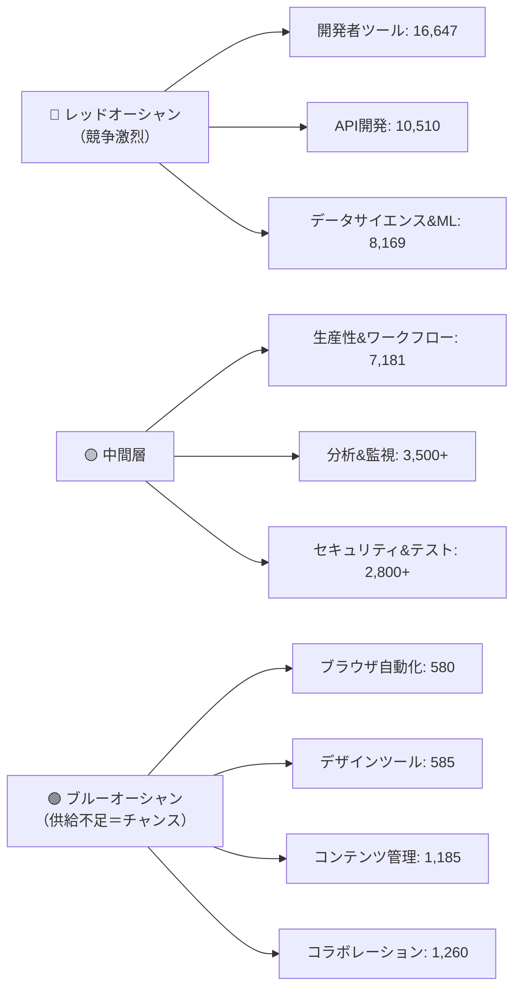
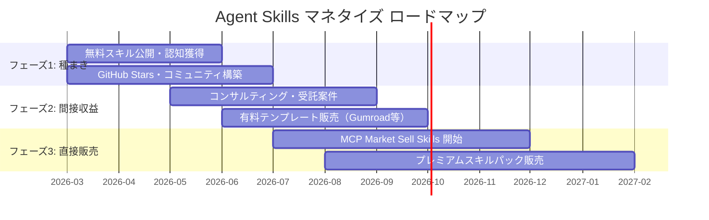
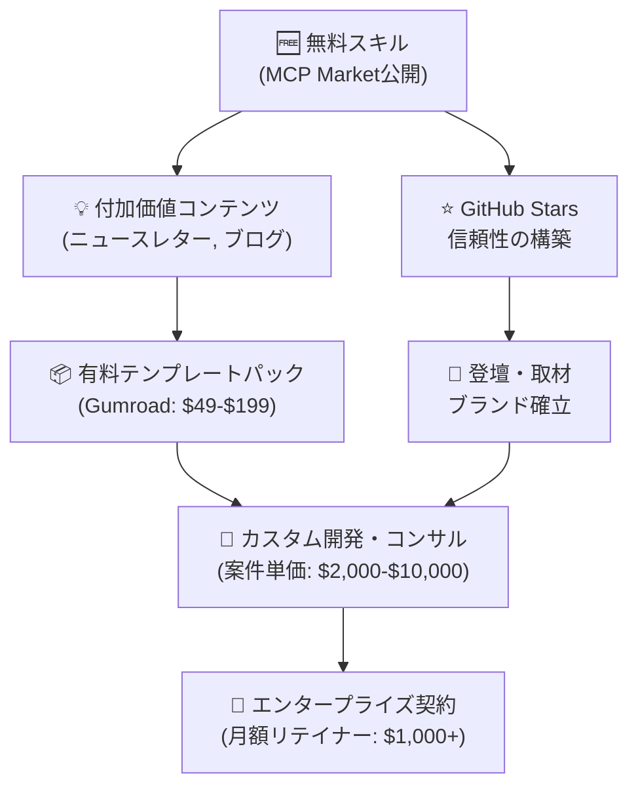

# Agent Skills販売 — 勝率の高い戦略レポート

> **調査日:** 2026年3月15日  
> **目的:** MCP Market / Agent Skillsエコシステムでの最適な参入戦略を策定する

---

## 📊 市場の現状データ（2026年3月時点）

### MCP Market 全体像

| 指標 | 数値 |
|---|---|
| **総登録スキル数** | **62,236** |
| **日本のAIエージェント市場（2025年）** | 3,616億ドル |
| **日本のAI市場成長率（CAGR）** | 49.9%（2026〜2033年） |
| **MCP Market 直接販売機能** | **Coming Soon（準備中）** |

### カテゴリ別スキル数（供給マップ）

### 人気スキル ベンチマーク（トップ5）

| スキル名 | インストール数 | カテゴリ |
|---|---|---|
| **Frontend Design**（Anthropic公式） | 277,000+ | デザイン |
| **gog**（Google Workspace CLI） | 29,400+ | 生産性 |
| **tavily-search**（AI検索） | 23,800+ | リサーチ |
| **summarize**（PDF/URL要約） | 22,400+ | 生産性 |
| **github**（GitHub CLI統合） | 21,600+ | 開発 |

> [!IMPORTANT]
> **最人気スキルの共通点**: ①明確な課題を解決する ②日常のワークフローに直結する ③セットアップの手間が最小限

### 日本語スキルの現状

現在、日本語関連のスキルは**数件のみ**と極めて少数：
- ビジネス日本語スペシャリスト（敬語／メール）
- SEO Mastery JP
- 記事翻訳（英日）
- アニメ&マンガ プロンプトビルダー
- PR説明文フォーマット

> [!TIP]
> 日本語特化スキルの供給は圧倒的に不足しており、**「日本語 × ブルーオーシャンカテゴリ」の掛け合わせが最も競争の少ない領域**です。

---

## 🎯 勝率の高い戦略

### 前提：収益化のタイムライン

MCP Marketの直接販売機能（Sell Skills）は**Coming Soon**の状態です。つまり、戦略を3フェーズに分ける必要があります。

---

### 🏆 戦略1: 「日本語ビジネス自動化」ニッチの制圧 ⭐推奨⭐

**コンセプト:** 日本の中小企業（SME）が直面する固有の業務課題をAIエージェントで解決するスキルセットを開発し、「日本語ビジネスAI自動化」カテゴリのトップブランドを確立する。

#### なぜ勝率が高いか

| 要因 | 詳細 |
|---|---|
| **供給ギャップ** | 日本語スキルは5件未満。62,000+の中で圧倒的ブルーオーシャン |
| **需要の確実性** | 日本のSMEのAI利用率はわずか16%だが市場成長率49.9% |
| **参入障壁** | 日本語の文化的ニュアンス（敬語、商慣習）がグローバル競合を阻む |
| **スケーラビリティ** | 一度作れば繰り返し利用可能な構造 |

#### 具体的なスキル候補

##### Tier 1: 即効性の高いスキル（最初の1ヶ月で公開）

| スキル名 | 概要 | 想定ニーズ |
|---|---|---|
| **📧 日本語ビジネスメール・マスター** | TPOに応じた完璧な日本語ビジネスメールの作成。敬語レベル自動調整、挨拶文・締め文の自動選択、添付要否の判断 | フリーランサー、外国人ビジネスパーソン |
| **📄 日本語議事録ジェネレーター** | 会議メモ/音声テキストから構造化された日本語議事録を生成。決定事項・タスク・次回アクションの自動抽出 | 全業種の会議参加者 |
| **🧾 インボイス制度対応チェッカー** | 請求書が適格請求書の要件を満たしているか自動チェック。登録番号検証、消費税計算確認 | 経理担当者、個人事業主 |

##### Tier 2: 高付加価値スキル（2〜3ヶ月目）

| スキル名 | 概要 | 想定ニーズ |
|---|---|---|
| **📋 下請法コンプライアンスチェッカー** | 発注書・契約書が下請法に違反していないか自動分析 | 購買部門、法務部門 |
| **🏠 不動産重要事項説明書ドラフター** | 物件情報から重要事項説明書のドラフトを自動生成 | 不動産業者 |
| **📊 日本語プレゼンテーション構成師** | 日本のビジネス文化に適した構成（起承転結）でスライド骨子を生成 | 営業、企画職 |

##### Tier 3: プレミアムスキルパック（4ヶ月目以降）

| パック名 | 含まれるスキル | 想定価格帯 |
|---|---|---|
| **🇯🇵 Japan Business Starter Kit** | メール + 議事録 + プレゼン + 敬語辞典 | $49〜$99 |
| **🏢 SME DXツールキット** | インボイス + 下請法 + 見積書作成 + 業務フロー最適化 | $99〜$199 |
| **🌐 Japan Market Entry Kit** | 外国企業向け日本進出支援（法規制、ビジネスマナー、市場分析） | $149〜$299 |

---

### 🏆 戦略2: 「ブラウザ自動化」カテゴリの先行制圧

**コンセプト:** MCP Market全体で最も供給が少ない「ブラウザ自動化（580件）」カテゴリに特化し、日本特有のWebサービス（e-Gov、freee、マネーフォワード等）の自動操作スキルを開発する。

#### 具体的なスキル候補

| スキル名 | 概要 |
|---|---|
| **e-Gov自動申請アシスタント** | 電子政府サービスでの各種届出をガイド＆自動化 |
| **クラウド会計連携スキル** | freee / マネーフォワードとの連携で経費入力・レポート生成を自動化 |
| **日本語Webリサーチャー** | 日本語サイト特化の情報収集・要約（Yahoo! Japan、はてブ等対応） |

---

### 🏆 戦略3: コンテンツ連動型ファネル（フリーミアム）

**コンセプト:** 無料スキルを「入り口」として、より高額なサービス（コンサル、カスタム開発、有料コース）への導線を構築する。

#### 無料スキルに含めるべき要素

| 要素 | 目的 |
|---|---|
| スキル内のREADMEにブログ/ニュースレターリンク | リード獲得 |
| 「プロ版はこちら」メッセージ | アップセル |
| GitHub Sponsors リンク | 直接支援 |
| 使い方のYouTube動画リンク | エンゲージメント & SEO |

---

## 📐 収益シミュレーション

### 保守的シナリオ（6ヶ月後）

| 収益源 | 月間見込み |
|---|---|
| 有料テンプレート販売（Gumroad） | ¥30,000〜¥80,000 |
| コンサルティング（月1〜2件） | ¥100,000〜¥300,000 |
| GitHub Sponsors | ¥5,000〜¥20,000 |
| **合計** | **¥135,000〜¥400,000** |

### 楽観的シナリオ（12ヶ月後、Sell Skills機能稼働後）

| 収益源 | 月間見込み |
|---|---|
| MCP Market直接販売 | ¥50,000〜¥200,000 |
| 有料テンプレート販売 | ¥80,000〜¥200,000 |
| コンサルティング / 受託 | ¥300,000〜¥800,000 |
| 教育コンテンツ（Udemy等） | ¥30,000〜¥100,000 |
| Sponsors / アフィリエイト | ¥20,000〜¥50,000 |
| **合計** | **¥480,000〜¥1,350,000** |

---

## 🚀 即実行アクションプラン

### Week 1-2: 基盤構築

- [ ] GitHubリポジトリ作成（`japan-agent-skills` 等）
- [ ] `skillfish init` でスキルテンプレート生成
- [ ] Tier 1スキル第1弾の `SKILL.md` 作成（日本語ビジネスメール・マスター）
- [ ] MCP Marketへの登録申請（`skillfish submit`）

### Week 3-4: 拡充 & マーケティング

- [ ] Tier 1の残り2つのスキルを公開
- [ ] 各スキルの使い方ブログ記事 or Qiita投稿
- [ ] X (Twitter) / LinkedIn でのローンチ告知
- [ ] フィードバック収集 & 改善サイクル開始

### Month 2: 収益化開始

- [ ] Gumroadで「Japan Business Starter Kit」販売開始
- [ ] コンサルティングサービスの告知ページ作成
- [ ] Tier 2スキルの開発着手

### Month 3-6: スケーリング

- [ ] MCP Market Sell Skills機能が開始次第、有料スキル出品
- [ ] ニュースレター or 有料コース開設
- [ ] エンタープライズ向けカスタムスキル開発サービス告知

---

## ⚡ 成功のための鍵

### 1. 「最初の10スキル」を最速で公開する
> 市場が黎明期の今、**量 × スピード**でカテゴリを制圧することが最重要。完璧を求めるよりも、実用的なスキルを素早くリリースし、フィードバックで改善する。

### 2. 「日本語」という天然の参入障壁を活用する
> 英語圏の開発者が簡単には参入できない日本語スキルは、長期的な競争優位を形成する。

### 3. スキル単体ではなく「エコシステム」を構築する
> 個別スキル → スキルパック → コンサル → 教育 という層構造で、顧客のライフサイクル全体を捉える。

### 4. 「情報」ではなく「実行結果」を売る
> 「日本語メールの書き方ガイド」ではなく、「1クリックで完璧な日本語ビジネスメールが完成するスキル」として価値を提供する。

### 5. データで検証し続ける
> GitHubのスター数、MCP Marketのダウンロード数、Gumroadの売上データを毎週チェックし、リソースを最も成果の出ているスキルに集中させる。

---

> [!NOTE]
> このレポートは2026年3月15日時点の調査に基づいています。MCP Marketの販売機能（Sell Skills）の正式ローンチ時期によって、フェーズ3のタイムラインは変動する可能性があります。

> [!CAUTION]
> Agent Skillsはファイルシステムやネットワークにアクセスできるため、セキュリティリスクが指摘されています。スキル開発時は、必要最小限の権限のみを要求し、安全なコーディングプラクティスを徹底してください。
